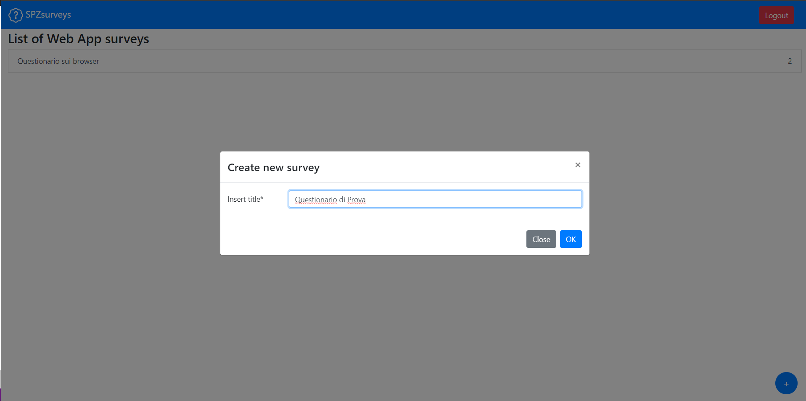
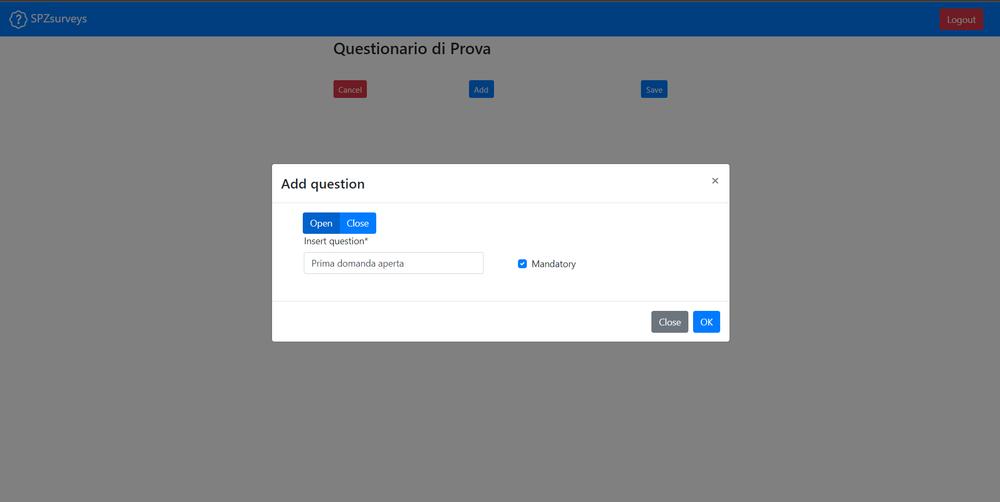
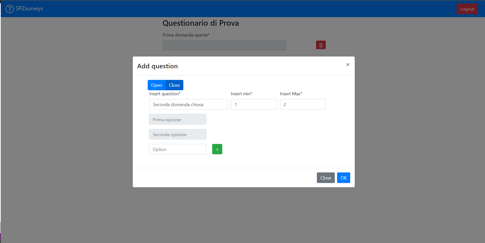
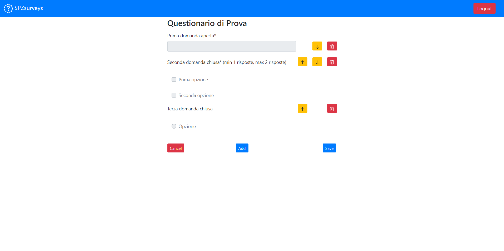

# Exam #1: "Questionario"
## Student: s292559 ANDREA SPEZIALE

## React Client Application Routes
- Route `/surveys`: Questa pagina conterrà una lista di questionari disponibili alla compilazione per gli utenti (non admin)
- Route `/login`: Questa è la pagina di login dove un admin può inserire il suo account e password per accedere alla propria pagina personale
- Route `/surveys/:id`: Questa è la pagina che conterrà il questionario avente un certo id passato come parametro e le relative domande. Qui è possibile ovviamente effettuare la compilazione e l'invio del questionario
- Route `/admin/surveys`: Questa pagina comparirà a seguito del login e conterrà l'elenco dei questionari inseriti da un certo admin con la possibilità di aggiungerne di nuovi. Direttamente da questa route si potrà avere un cambio di componenti dopo aver cliccato il bottore per aggiungere un nuovo questionario. Apparirà infatti tutto il necessario per inserire un nuovo questionario
- Route `/admin/surveys/:id`: Questa è la pagina che conterrà il questionario avente un certo id passato come parametro e le relative domande compilate da un certo utente. Nel caso di più compilazioni da diversi utenti è possibile usare i bottoni Next e Back per scorrerle.
- Route `/`: Questa route non è utilizzata ma, se ci si dovesse giungere, verrà fatto un reindirizzamento verso `/surveys` oppure `/admin/surveys` in caso di admin loggato

## API Server

- POST `/api/sessions`:
  - Description: authenticate (login) admin with account and password
  - Request body:
   ```
   {
     "username":"andrea.speziale@studenti.polito.it" ,"password":"studente"
    }
   ```
  - Request parameters: None
  - Reponse: `200 OK` (success) or `500 Internal Server Error` (generic error)
  - Response body:
    ```
      {
          "id": 3,
          "username": "andrea.speziale@studenti.polito.it",
          "name": "Andrea"
      }
    ```
- DELETE `api/sessions/current`:
  - Description: log out admin currently logged in
  - Request body: None
  - Request parameters: None
  - Reponse: `200 OK` (success) or `500 Internal Server Error` (generic error)
  - Response body: None

- GET `api/sessions/current`:
  - Description: Get current session to check if admin logged out
  - Request body: None
  - Request parameters: None
  - Reponse: `200 OK` (success) or `500 Internal Server Error` (generic error)
  - Response body:
    ```
      {
        "id": 3,
        "username": "andrea.speziale@studenti.polito.it",
        "name": "Andrea"
      }
    ```
- GET `/api/surveys`
  - Description: Get all available Surveys for normal user (no Admin)
  - Request body: None
  - Request parameters: None
  - Reponse: `200 OK` (success) or `500 Internal Server Error` (generic error)
  - Response body:
    ```
    [
      {
        "id": 44,
        "title": "Questionario sull'uso delle bevande"
      },
      {
        "id": 45,
        "title": "Questionario mare/montagna"
      },
      {
        "id": 49,
        "title": "Questionario sui browser"
      }
    ]
    ```
- GET `/api/surveys/<id>`
  - Description: Get specific survey with questions for normal user (no Admin)
  - Request body: None
  - Request parameters: id (in this example id=44)
  - Reponse: `200 OK` (success) or `500 Internal Server Error` (generic error)
  - Response body:
    ```
    [
    {
        "questionSortID": 1,
        "questionText": "Età",
        "type": "open",
        "questionID": 16,
        "min": 1,
        "max": 1,
        "optionSortID": null,
        "optionID": null,
        "optionText": null
    },
    {
        "questionSortID": 2,
        "questionText": "Quali tra queste bevande consumi?",
        "type": "close",
        "questionID": 17,
        "min": 1,
        "max": 8,
        "optionSortID": 1,
        "optionID": 46,
        "optionText": "Coca cola"
    },
    {
        "questionSortID": 2,
        "questionText": "Quali tra queste bevande consumi?",
        "type": "close",
        "questionID": 17,
        "min": 1,
        "max": 8,
        "optionSortID": 2,
        "optionID": 47,
        "optionText": "Pepsi"
    },
    {
        "questionSortID": 2,
        "questionText": "Quali tra queste bevande consumi?",
        "type": "close",
        "questionID": 17,
        "min": 1,
        "max": 8,
        "optionSortID": 3,
        "optionID": 48,
        "optionText": "Fanta"
    },
    {
        "questionSortID": 2,
        "questionText": "Quali tra queste bevande consumi?",
        "type": "close",
        "questionID": 17,
        "min": 1,
        "max": 8,
        "optionSortID": 4,
        "optionID": 49,
        "optionText": "Sprite"
    },
    {
        "questionSortID": 2,
        "questionText": "Quali tra queste bevande consumi?",
        "type": "close",
        "questionID": 17,
        "min": 1,
        "max": 8,
        "optionSortID": 5,
        "optionID": 50,
        "optionText": "Chinotto"
    },
    {
        "questionSortID": 2,
        "questionText": "Quali tra queste bevande consumi?",
        "type": "close",
        "questionID": 17,
        "min": 1,
        "max": 8,
        "optionSortID": 6,
        "optionID": 51,
        "optionText": "7Up"
    },
    {
        "questionSortID": 2,
        "questionText": "Quali tra queste bevande consumi?",
        "type": "close",
        "questionID": 17,
        "min": 1,
        "max": 8,
        "optionSortID": 7,
        "optionID": 52,
        "optionText": "Tea"
    },
    {
        "questionSortID": 2,
        "questionText": "Quali tra queste bevande consumi?",
        "type": "close",
        "questionID": 17,
        "min": 1,
        "max": 8,
        "optionSortID": 8,
        "optionID": 53,
        "optionText": "Lemon soda"
    },
    {
        "questionSortID": 3,
        "questionText": "Quanto frequentemente le consumi?",
        "type": "close",
        "questionID": 18,
        "min": 1,
        "max": 1,
        "optionSortID": 1,
        "optionID": 54,
        "optionText": "Una volta alla settimana"
    },
    {
        "questionSortID": 3,
        "questionText": "Quanto frequentemente le consumi?",
        "type": "close",
        "questionID": 18,
        "min": 1,
        "max": 1,
        "optionSortID": 2,
        "optionID": 55,
        "optionText": "Tra 1 e 3 volte alla settimana"
    },
    {
        "questionSortID": 3,
        "questionText": "Quanto frequentemente le consumi?",
        "type": "close",
        "questionID": 18,
        "min": 1,
        "max": 1,
        "optionSortID": 3,
        "optionID": 56,
        "optionText": "Almeno 5 volte alla settimana"
    },
    {
        "questionSortID": 3,
        "questionText": "Quanto frequentemente le consumi?",
        "type": "close",
        "questionID": 18,
        "min": 1,
        "max": 1,
        "optionSortID": 4,
        "optionID": 57,
        "optionText": "Tutti i giorni"
    }
    ]
    ```
- POST `/api/surveys/<id>`:
  - Description: POST answers for a specific survey 
  - Request body: (this example is different from the previous one)
    ```
    [
      {
        "questionID":1,
        "optionID":null,
        "user":"Jack",
        "answerText":"Jack"
      },
      {
        "questionID":2,
        "optionID":null,
        "user":"Jack",
        "answerText":"Sparrow"
      },
      {
        "questionID":4,
        "optionID":2,
        "user":"Jack",
        "answerText":null
      },
      {
        "questionID":4,
        "optionID":1,
        "user":"Jack",
        "answerText":null
      },
      {
        "questionID":5,
        "optionID":5,
        "user":"Jack",
        "answerText":null
      }
    ]
    ```
  - Request parameters: survey id
  - Reponse: `200 OK` (success) or `500 Internal Server Error` (generic error)
  - Response body: None

- GET `/api/admin/<id>/surveys`:
  - Description: GET all the surveys of admin with specific id 
  - Request body: None
  - Request parameters: admin id (in this case id=3)
  - Reponse: `200 OK` (success) or `500 Internal Server Error` (generic error)
  - Response body: 
    ```
    [
      {
          "id": 44,
          "title": "Questionario sull'uso delle bevande",
          "nCompiled": 2
      },
      {
          "id": 45,
          "title": "Questionario mare/montagna",
          "nCompiled": 2
      }
    ]
    ```
- GET `/api/admin/surveys/<surveyID>`:
  - Description: for a specific survey GET questions, answers and a list of users who compiled the survey
  - Request body: None
  - Request parameters: survey id
  - Reponse: `200 OK` (success) or `500 Internal Server Error` (generic error)
  - Response body: 
    ```
    [
    [
        "Andrea",
        "Giuseppe"
    ],
    [
        {
            "questionSortID": 1,
            "questionText": "Età",
            "type": "open",
            "min": 1,
            "max": 1
        },
        {
            "questionSortID": 2,
            "questionText": "Quali tra queste bevande consumi?",
            "type": "close",
            "min": 1,
            "max": 8,
            "options": [
                {
                    "optionSortID": 1,
                    "optionText": "Coca cola"
                },
                {
                    "optionSortID": 2,
                    "optionText": "Pepsi"
                },
                {
                    "optionSortID": 3,
                    "optionText": "Fanta"
                },
                {
                    "optionSortID": 4,
                    "optionText": "Sprite"
                },
                {
                    "optionSortID": 5,
                    "optionText": "Chinotto"
                },
                {
                    "optionSortID": 6,
                    "optionText": "7Up"
                },
                {
                    "optionSortID": 7,
                    "optionText": "Tea"
                },
                {
                    "optionSortID": 8,
                    "optionText": "Lemon soda"
                }
            ]
        },
        {
            "questionSortID": 3,
            "questionText": "Quanto frequentemente le consumi?",
            "type": "close",
            "min": 1,
            "max": 1,
            "options": [
                {
                    "optionSortID": 1,
                    "optionText": "Una volta alla settimana"
                },
                {
                    "optionSortID": 2,
                    "optionText": "Tra 1 e 3 volte alla settimana"
                },
                {
                    "optionSortID": 3,
                    "optionText": "Almeno 5 volte alla settimana"
                },
                {
                    "optionSortID": 4,
                    "optionText": "Tutti i giorni"
                }
            ]
        }
    ],
    [
        {
            "user": "Andrea",
            "questionSortID": 1,
            "answerText": "23"
        },
        {
            "user": "Andrea",
            "questionSortID": 2,
            "options": [
                {
                    "optionSortID": 1,
                    "value": true
                },
                {
                    "optionSortID": 2,
                    "value": true
                },
                {
                    "optionSortID": 3,
                    "value": false
                },
                {
                    "optionSortID": 4,
                    "value": false
                },
                {
                    "optionSortID": 5,
                    "value": false
                },
                {
                    "optionSortID": 6,
                    "value": false
                },
                {
                    "optionSortID": 7,
                    "value": false
                },
                {
                    "optionSortID": 8,
                    "value": false
                }
            ]
        },
        {
            "user": "Andrea",
            "questionSortID": 3,
            "options": [
                {
                    "optionSortID": 1,
                    "value": true
                },
                {
                    "optionSortID": 2,
                    "value": false
                },
                {
                    "optionSortID": 3,
                    "value": false
                },
                {
                    "optionSortID": 4,
                    "value": false
                }
            ]
        },
        {
            "user": "Giuseppe",
            "questionSortID": 1,
            "answerText": "35"
        },
        {
            "user": "Giuseppe",
            "questionSortID": 2,
            "options": [
                {
                    "optionSortID": 1,
                    "value": true
                },
                {
                    "optionSortID": 2,
                    "value": true
                },
                {
                    "optionSortID": 3,
                    "value": true
                },
                {
                    "optionSortID": 4,
                    "value": true
                },
                {
                    "optionSortID": 5,
                    "value": true
                },
                {
                    "optionSortID": 6,
                    "value": true
                },
                {
                    "optionSortID": 7,
                    "value": true
                },
                {
                    "optionSortID": 8,
                    "value": true
                }
            ]
        },
        {
            "user": "Giuseppe",
            "questionSortID": 3,
            "options": [
                {
                    "optionSortID": 1,
                    "value": false
                },
                {
                    "optionSortID": 2,
                    "value": false
                },
                {
                    "optionSortID": 3,
                    "value": false
                },
                {
                    "optionSortID": 4,
                    "value": true
                }
            ]
        }
    ]
    ]
    ```
  - Note: To get all these informations in only one GET I used a very very complex Query
- POST `/api/admin/survey`:
  - Description: POST a new survey
  - Request body: 
    ```
    {
      "title": "questionario di prova",
      "survey": 
      [
        {
          "questionSortID":1,
          "questionText":"Prima domanda",
          "type":"open",
          "min":1,
          "max":1,
          "options":null
        },
        {
          "questionSortID":2,
          "questionText":"Seconda domanda",
          "type":"open",
          "min":1,
          "max":1,
          "options":null
          },
          {
            "questionSortID":3,
            "questionText":"Terza domanda",
            "type":"close",
            "min":1,
            "max":1,
            "options":
              [
                {
                  "optionSortID":1,
                  "optionText":"Prima opzione"
                }, 
                {
                  "optionSortID":2,
                  "optionText":"Seconda opzione"
                }
              ]
          }
      ],
      "adminID": "3"
    }
    ```
  - Request parameters: survey id
  - Reponse: `200 OK` (success) or `500 Internal Server Error` (generic error)
  - Response body: None

- GET `/api/surveys/<id>/users`:
  - Description: GET list of users who answered to a survey
  - Request body: None
  - Request parameters: survey id (in this case id=44)
  - Reponse: `200 OK` (success) or `500 Internal Server Error` (generic error)
  - Response body:
    ```
    [
      "Andrea",
      "Giuseppe"
    ]
    ```


## Database Tables

- Table `ADMINS` - contains ID, name, email, password:
  - Lo scopo di questa tabella è memorizzare tutti gli admin con l'id (autoincrementale), nome, email e password cifrata
- Table `SURVEYS` - contains ID, title, adminID:
  - Memorizza l'elenco dei questionari disponibili alla compilazione con info relative a ID, titolo e id dell'admin che l'ha creato. Quest'ultima informazione è rappresentata come chiave esterna ID di ADMINS
- Table `QUESTIONS` - contains ID, surveyID, questionSortID, text, type, min, max:
  - Questa tabella memorizza l'elenco di tutte le domande di tutti i questionari e di ogni tipo (quindi sia close che open) con relative informazioni tra le quali anche surveyID che è chiave esterna di ID appartenente a SURVEYS e questionSortID che servirà per gestire l'ordine di visualizzazione delle domande.
- Table `OPTIONS` - contains ID, questionID, optionSortID, text:
  - Qui verranno memorizzate tutte le opzioni di ogni domanda chiusa. Saranno presenti, oltre a ID, questionID e text, anche il questionID come chiave esterna di ID appartenente a QUESTIONS
- Table `USERANSWERS` - contains ID, surveyID, questionID, optionID, user, answerText
  - Questa tabella conterrà l'elenco di tutte le risposte date a ogni domanda (di qualsiasi tipo) di ogni questionario da ogni user. Ogni riga avrà varia chiavi esterne per poter fare riferimento ai relativi questionari, domande e opzioni di appartenenza. 
  NOTA: per una risposta a domanda aperta avremo la risposta in answerText ma con optionID nullo, mentre per risposte chiuse sarà fatto al contrario.

## Main React Components
- `MyNavBar` (in `MyNavBar.js`): Rappresenta la navbar visibile su ogni pagina
- `Main` (in `main.js`): Questo componente sarà visualizzato quando si è in modalità user e rappresenterà la lista dei questionari disponibili. Conterrà anche varie route per gestire i vari casi
- `Element` (in `main.js`): Rappresenta la riga contenente il nome del questionario cliccabile
- `Survey2` (in `Survey.js`): Rappresenta l'interfaccia con le domande del questionario compilabile e i bottoni per salvare la risposta. Contiene anche le funzioni per la validazione
- `Question2` (in `Survey.js`): Gestisce i vari tipi di domanda
- `OpenQuestion2`, `CloseQuestion2` e `RadioQuestion2` (in `SurveyComponents.js`): Sono gli oggetti che rappresentano le domande vere e proprie e contengono la gestione delle risposte e come vengono memorizzate
- `Main` (in `MainAdmin.js`): Questo componente sarà visualizzato quando si è in modalità admin e rappresenterà la lista dei questionari creati. Conterrà anche varie route per gestire i vari casi
- `AddButton` (in `Button.js`): é il componente che permette di aggiungere un nuovo questionario e contiene la validazione e la gestione delle strutture dati adottate
- `AddQuestionButton` (in `Button.js`): é il componente che permette di aggiungere una nuova domanda e contiene la validazione e la gestione delle strutture dati adottate
- `SaveQuestionButton` (in `Button.js`): é il componente che permette di salvare il questionario e inviarlo a server mediante l'opportuna fetch
- `MyModal` (in `MyModal.js`): è il componente che permette di far apparire il Modal e si servirà di MyForm essere riempito
- `MyForm` (in MyForm.js): rappresenterà il contenuto del Modal e conterrà i componenti necessari per aggiungere una nuova domanda aperta o chiusa.
- Il file `Obj.js` conterrà gli oggetti relativi alle strutture dati delle domande, opzioni e risposte
- Il file `Login.js` conterrà gli elementi per gestire il login

## Screenshot






## Users Credentials

- andrea.speziale@studenti.polito.it, studente
- webapp@studenti.polito.it, webapplication
